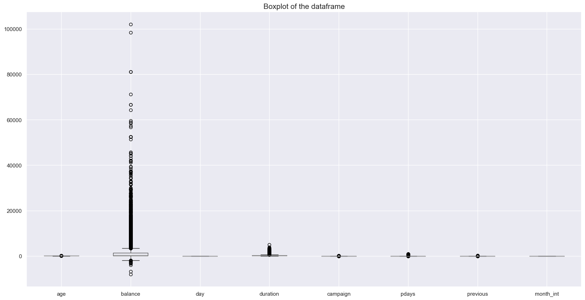
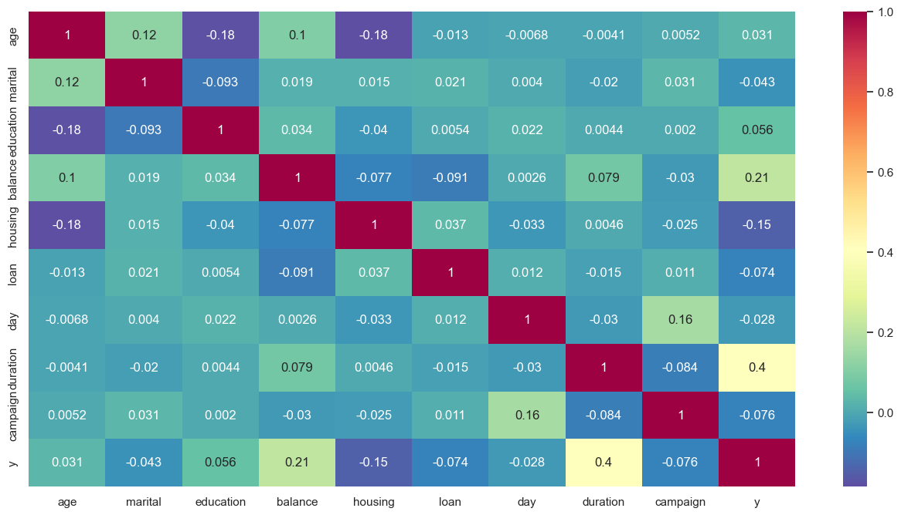
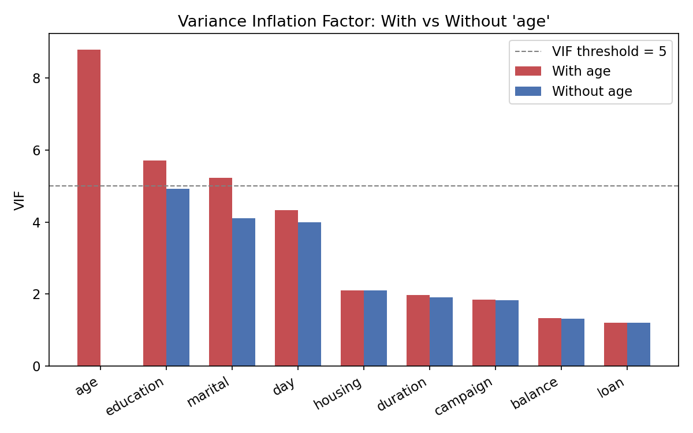
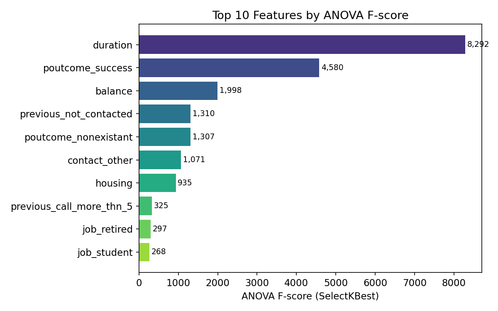
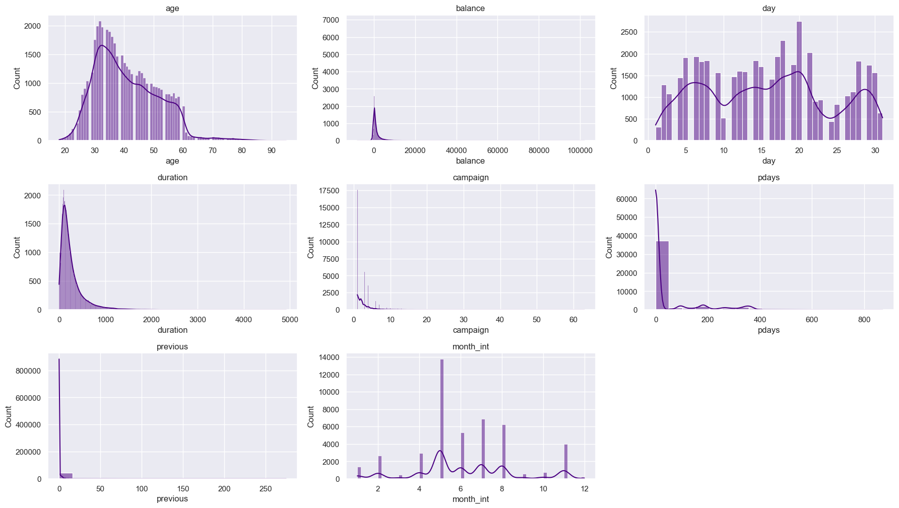
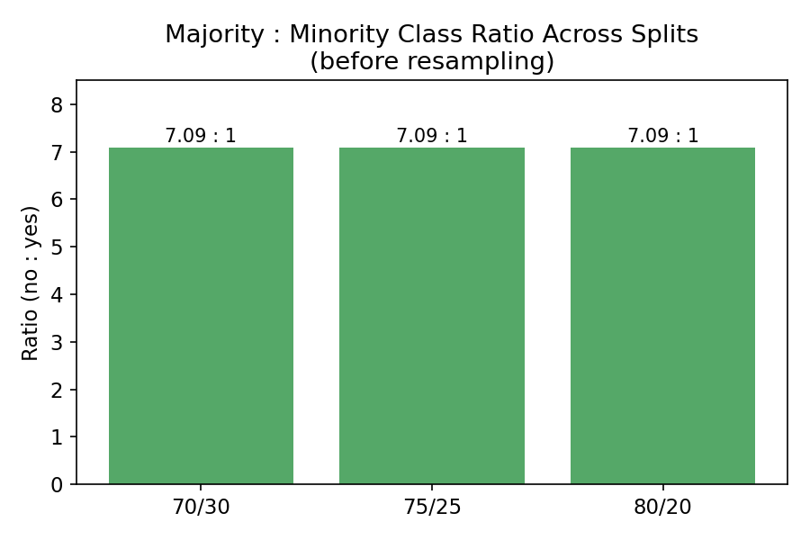
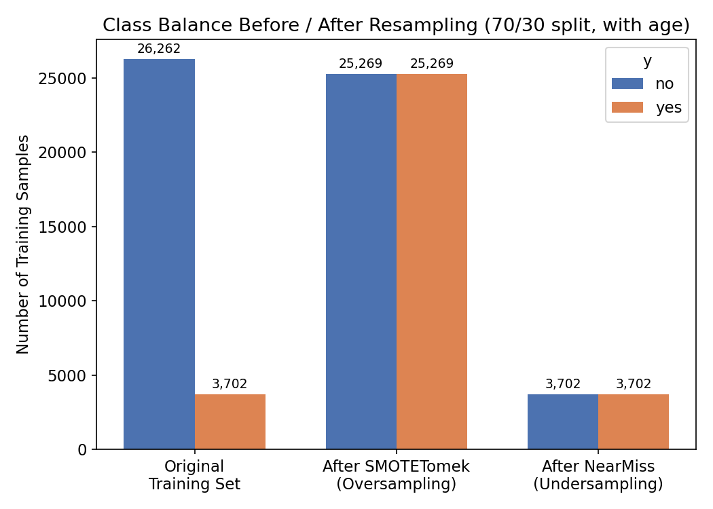
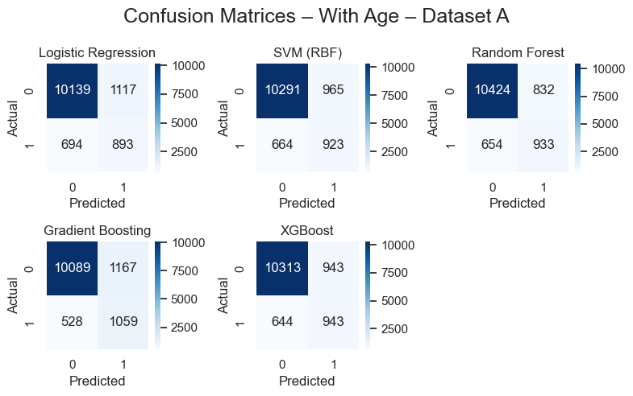
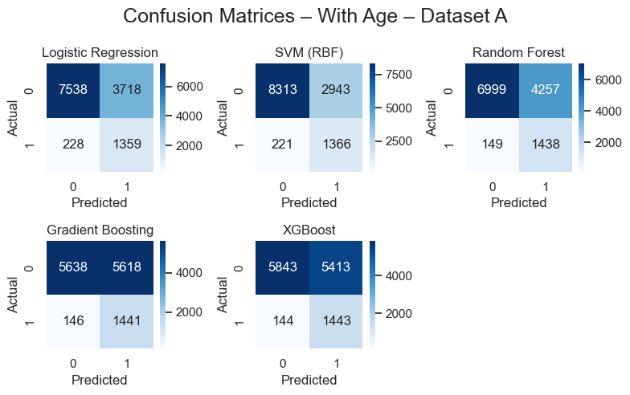
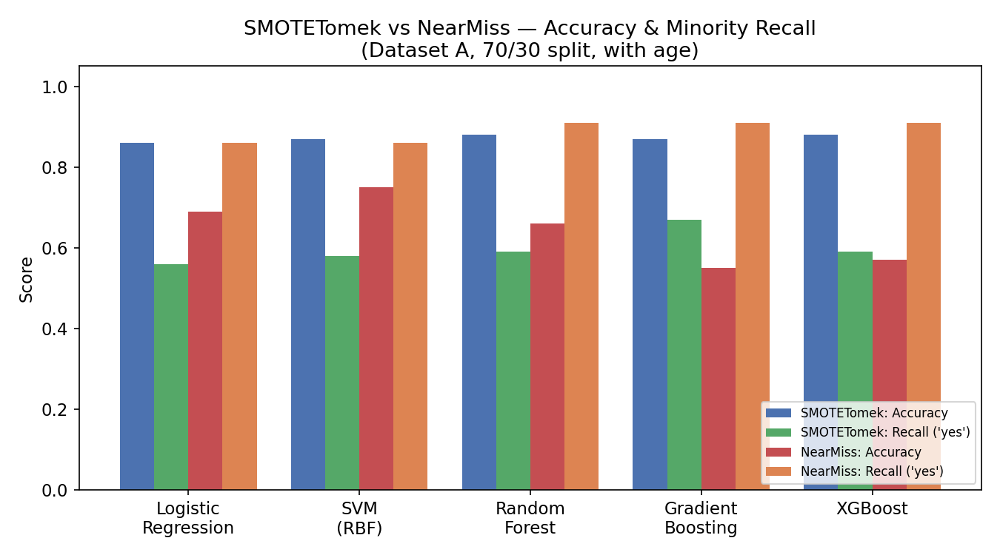

# Bank Marketing – Term Deposit Subscription Prediction

Data mining project analyzing the UCI **Bank Marketing** dataset to predict whether a client will subscribe to a term deposit, based on demographic, account, and campaign-contact data.

**Course:** Data Mining (048DMIDL5) — Université Saint-Joseph de Beyrouth
**Instructor:** Dr. Eng. PhD Nicole Challita
**Authors:** Mohamad Badra (242422), Oussama Obeid (243170)

## Overview

The project follows a full data mining pipeline on `bank-full.csv` (UCI Machine Learning Repository, Portuguese bank marketing campaign data):

1. **Data Collection** – load and inspect the raw dataset.
2. **Data Discovery** – shape, dtypes, numeric/categorical splits, summary statistics, missing/unique values, target imbalance check, month → month-number conversion.
3. **EDA** – class imbalance visualization, pairplots of numeric features, top-category plots and target (`y`) comparisons for categorical features.
4. **Data Cleaning** – handling `"unknown"` placeholders (remapped to `"other"` or, for `poutcome`, `"nonexistent"`), and outlier treatment on `balance` (threshold ~5000, keeping high-balance subscribers to protect the minority class).
5. **Feature Engineering & Encoding** – `day` converted into `week` buckets (1–4), label encoding for ordinal/binary categoricals, one-hot encoding for the rest.
6. **Correlation & VIF** – multicollinearity check; `age` removed in one variant since it was the only feature above the VIF threshold of 5.
7. **Feature Selection** – ANOVA (`SelectKBest`) to rank features; low-importance features (including `day`, superseded by `week`) dropped.
8. **Train/Test Splits** – compared 70/30, 75/25, and 80/20 splits.
9. **Class Imbalance Handling** – oversampling with **SMOTETomek** and, separately, undersampling with **NearMiss**, each followed by feature scaling (`StandardScaler`).
10. **Modeling** – Logistic Regression, SVM, Random Forest, Gradient Boosting, and XGBoost, trained/evaluated across dataset variants (with/without `age`) and the three split ratios, using confusion matrices and ROC/AUC curves.
11. **Evaluation** – SMOTETomek gave the most balanced results (better recall/F1 on the minority "yes" class with a small accuracy trade-off); NearMiss improved recall further but at a cost to accuracy/precision and stability, especially for SVM and Logistic Regression.

## Data Cleaning: Outlier Treatment on `balance`

`balance` ranged from **-8,019 to 102,127**, with 75% of clients sitting at or below 1,428 — so the upper tail was extreme relative to the bulk of the data:



Rather than applying a strict IQR cutoff (~3,500) that would have discarded many legitimately high-balance clients, we used a more flexible threshold of 5,000, and only removed extreme high-balance outliers among clients who did **not** subscribe — high-balance subscribers ("yes") were kept regardless of the value, since the minority class is too small to afford losing rows to cleaning.

## Repository Contents

| File | Description |
|---|---|
| `bank-full.ipynb` | Full analysis notebook: preprocessing, EDA, feature engineering, modeling, and evaluation. |
| `Report.pdf` | Written project report describing methodology, findings, and conclusions. |
| `visuals/` | Charts referenced in this README — a mix of real plots exported from the notebook and summary charts built from its numeric outputs. |

## Dataset

- Source: [UCI Machine Learning Repository – Bank Marketing](https://archive.ics.uci.edu/dataset/222/bank+marketing)
- File used: `bank-full.csv` (not included here — download from UCI and place it alongside the notebook to reproduce results).

## Requirements

```
pandas
numpy
matplotlib
seaborn
scikit-learn
statsmodels
imbalanced-learn
xgboost
jupyter
```

Install with:
```bash
pip install -r requirements.txt
```

## Running

1. Download `bank-full.csv` from the UCI repository link above.
2. Place it in the project root (same folder as `bank-full.ipynb`).
3. Launch Jupyter and run the notebook top to bottom:
   ```bash
   jupyter notebook bank-full.ipynb
   ```

## Correlation & Multicollinearity (VIF)

A correlation heatmap over the numeric features guided which variables to inspect more closely for redundancy:



We then computed the **Variance Inflation Factor (VIF)** for each numeric/encoded feature. Using the common threshold of VIF > 5 as "high," `age` was the only feature that exceeded it (VIF ≈ 8.79) — driven by its natural correlation with `marital`, `education`, and `day`. Removing `age` brought every remaining feature under the threshold:



Because `age` still carries useful signal despite the multicollinearity, we trained and evaluated models **both with and without `age`** rather than dropping it outright, so we could directly compare the impact.

## Feature Selection (ANOVA / SelectKBest)

Using `SelectKBest` with the ANOVA F-test, we ranked every feature by how strongly it separates the "yes"/"no" classes. `duration` (the length of the last contact call) dominates by a wide margin, followed by `poutcome_success` (a prior successful campaign outcome) and `balance`:



Features scoring near zero (e.g. `job_self-employed`, `job_other`, `week_number_week_4`) contributed almost no separating power and were dropped, along with the raw `day` column once it had been superseded by the engineered `week` feature.

## Class Imbalance & Resampling

The target variable `y` is heavily skewed toward "no", which is a critical issue for this problem since the minority ("yes") class is the one the bank actually cares about.

**Original distribution (45,211 clients):**

| Class | Count | Percentage |
|---|---|---|
| no  | 39,922 | 88.3% |
| yes | 5,289  | 11.7% |



This ~7.1 : 1 imbalance held consistently across all three train/test splits we tested:



A model trained naively on this data can score ~88% accuracy while never correctly predicting a single "yes" — which is exactly the failure mode we needed to avoid. So before modeling, we compared two resampling strategies on the training data only (test sets were always left untouched and unbalanced, to reflect real-world class proportions at evaluation time).

### SMOTETomek (oversampling + cleanup)

`SMOTETomek` combines two techniques:
- **SMOTE** (Synthetic Minority Over-sampling Technique) generates new synthetic "yes" examples by interpolating between existing minority-class points and their nearest neighbors, rather than just duplicating rows.
- **Tomek Links** then scans for majority/minority pairs that sit right on the decision boundary and removes the majority-class member of each pair, cleaning up ambiguous or noisy samples.

Net effect: the minority class is built up synthetically *and* the majority class is lightly denoised, producing a training set that is both balanced and less noisy at the class boundary.

Example (70/30 split, with `age`): the training set went from **26,262 "no" vs 3,702 "yes"** to a balanced **25,269 vs 25,269** after SMOTETomek (some majority samples were dropped as Tomek links, so both classes converge slightly below the original majority count rather than exactly at it).

### NearMiss (undersampling)

`NearMiss` (version 1) balances classes in the opposite direction: it keeps all minority ("yes") samples and removes majority ("no") samples, specifically those farthest from the minority class's average distance are dropped first, so the majority samples that remain are the ones closest to — and therefore most informative about — the minority class boundary.

Example (same 70/30 split): the training set was reduced all the way down to **3,702 "no" vs 3,702 "yes"** — a much smaller but perfectly balanced training set.



### Trade-offs observed

| Strategy | Training set size (70/30, with age) | Effect on models |
|---|---|---|
| **None (original)** | 29,964 rows, 7.1:1 imbalance | High accuracy, very poor recall on "yes" |
| **SMOTETomek** | ~50,538 rows, balanced 1:1 | Best overall balance — strong recall/F1 gains on the minority class, with only a modest accuracy trade-off. Most reliable across all five models. |
| **NearMiss** | 7,404 rows, balanced 1:1 | Recall improved further, but accuracy and precision dropped noticeably due to information loss from discarding most of the majority class — most visible in SVM and Logistic Regression, less so in the tree-based models (Random Forest, Gradient Boosting). |

Both scaling and encoding were applied consistently after resampling (fit on the resampled training data, then applied to the untouched test set) to avoid data leakage.

## Model Evaluation

All five models — Logistic Regression, SVM, Random Forest, Gradient Boosting, and XGBoost — were trained and evaluated on both resampled datasets. Confusion matrices below are from **Dataset A (70/30 split, with `age`)**:

**After SMOTETomek:**



**After NearMiss:**



Comparing accuracy against minority-class ("yes") recall across all five models makes the trade-off concrete:



SMOTETomek models sit in the 86–88% accuracy range with recall for "yes" between 0.56–0.67. NearMiss models trade a lot of accuracy (55–75%) for much higher recall (0.86–0.91) — i.e. they catch far more true subscribers, but at the cost of many more false positives, which matters if the bank wants to control the cost of outreach per predicted lead.

## Key Findings

- The target variable is **highly imbalanced** (88.3% "no" vs 11.7% "yes", ~7.1:1), requiring resampling before modeling — a naive model could hit ~88% accuracy while never predicting a single "yes."
- `balance` had extreme outliers (up to 102,127) that were partially trimmed, while protecting high-balance subscribers from removal to avoid losing minority-class signal.
- `age` was the only feature with meaningful multicollinearity (VIF ≈ 8.79); models were trained with and without it to measure the impact directly.
- `duration` (last-contact call length) is by far the strongest predictor of subscription, followed by `poutcome_success` and `balance`.
- **SMOTETomek** produced the most balanced, reliable results overall: 86–88% accuracy with 0.56–0.67 recall on the "yes" class across all five models.
- **NearMiss** pushed minority recall higher (0.86–0.91) but at a steep cost to accuracy (55–75%) and precision, especially for SVM, Logistic Regression, and Gradient Boosting.
- Tree-based models (Random Forest, Gradient Boosting, XGBoost) were consistently more stable across both resampling strategies than the linear/kernel models.
